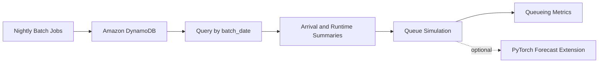

# Architecture

## Overview

## Components

### DynamoDB

`db_batch_window_requests` stores queued database jobs.

Primary key:

- partition key: `batch_date`
- sort key: `window_job_id`

This design supports the main tutorial access pattern:

- query all jobs for one nightly batch date
- optionally narrow the query to one requested window with `begins_with(window_job_id, "02:00#")`

The main tutorial path uses `Query`, not `Scan`.

### Sample Workload Catalog

[`sample_jobs.py`](../sample_jobs.py) contains four sample nightly runs:

- `2026-05-11`
- `2026-05-12`
- `2026-05-13`
- `2026-05-14`

The queue includes:

- `etl`
- `refresh`
- `backfill`
- `index_maintenance`

### Queue Analysis

[`queue_analysis.py`](../queue_analysis.py) provides:

- access-pattern summaries
- queueing feature extraction
- a simple discrete-event simulator
- blocking behavior for exclusive-lock jobs

The simulator reports:

- average wait
- p95 wait
- average queue length
- worker utilization
- overflow risk after the batch cutoff

### Tutorial Runner

[`tutorial.py`](../tutorial.py) is the main teaching script.

Local mode shows two reference cases:

- a stable batch night with `rho < 1`
- an overloaded batch night with `rho >= 1`

AWS mode queries one selected `batch_date` from DynamoDB and reports the same metrics plus consumed read capacity.

### Optional ML Extension

[`pytorch_extension.py`](../pytorch_extension.py) is intentionally outside the core path.

It demonstrates one honest use case for PyTorch: forecasting future queue pressure from historical nightly summaries when simple queueing assumptions no longer explain delay well.

## Design Notes

- This repo is a scheduling-analysis tutorial, not a production scheduler.
- For an operational asynchronous work queue on AWS, SQS is still the standard first choice.
- DynamoDB is used here as the workload catalog because the teaching target is database batch planning, not message brokering.
